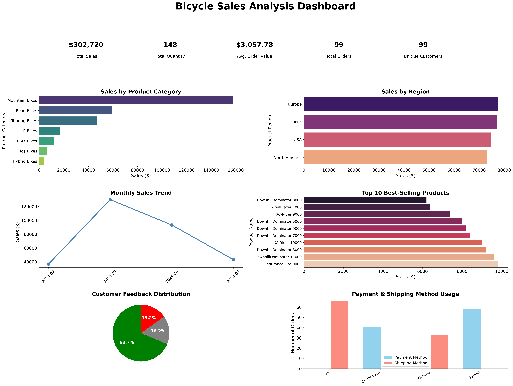
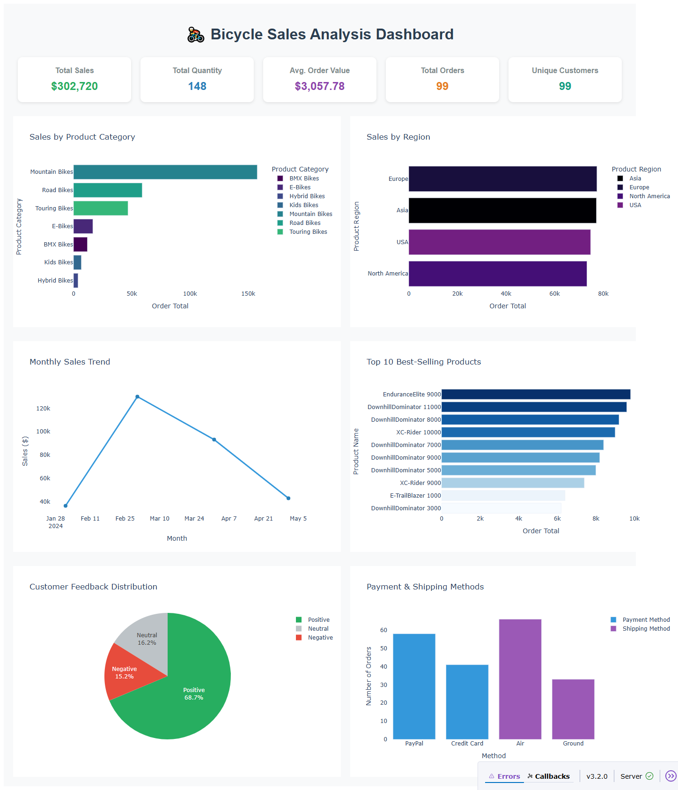

# Advanced-Pandas-Techniques-for-Data-Processing-and-Performance
By working with real-world data, I’ll demonstrate how Pandas can efficiently handle and analyze complex, multi-file datasets typically encountered in data science projects.you’ll find it makes handling structured data much easier. It gives you flexible, intuitive tools to work with even the most complex datasets.

# How to run?
### STEPS:

Clone the repository

```bash
git clone https://github.com/jamshedfarzandpk/data-analytics-sales-dashboard-using-python-pandas-matplotlib-seaborn-openpyxl.git
```
### STEP 01- Create a conda environment after opening the repository

```bash
conda create -n dashboard python=3.12 -y
```

```bash
conda activate dashboard
```

### STEP 02- install the requirements
```bash
pip install -r requirements.txt --use-pep517

```
#
### STEP 03- run the following command
```bash
python main.py

```

### STEP 05- Screenshots of the app results:
Screenshot of the app results after running the main.py file:
1.after reading the xls file and creating the dashboard

```
```
## STEP 06 Screenshots of the app.py results:
Screenshot of the app results after running the app.py file:
1.after reading the xls file and creating the dash library dashboard in html 

